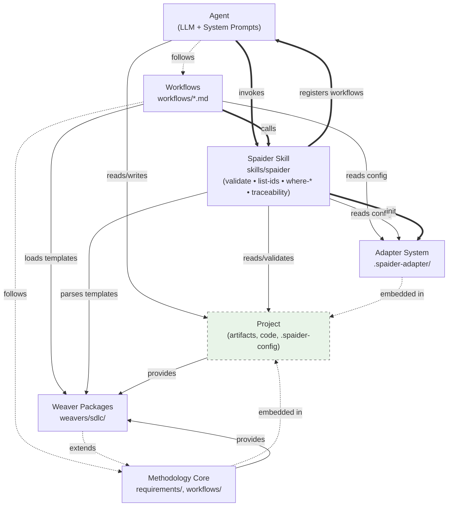
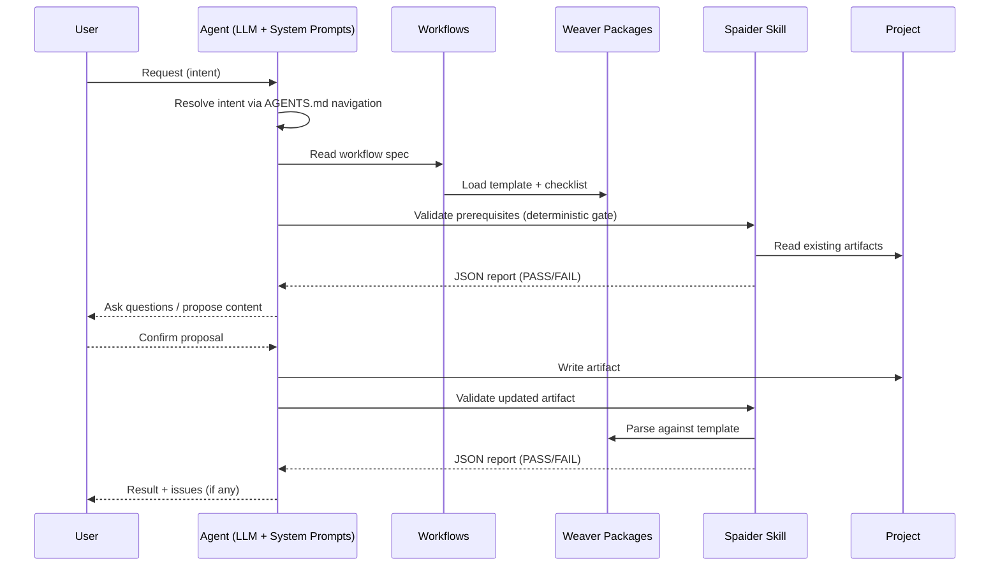
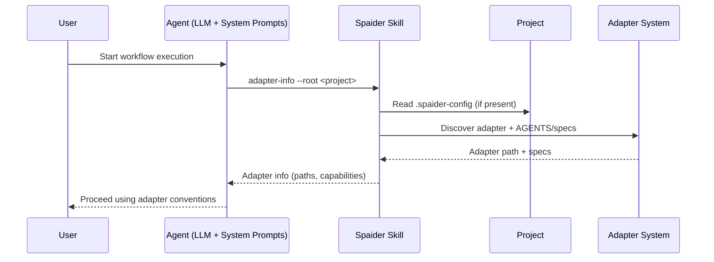
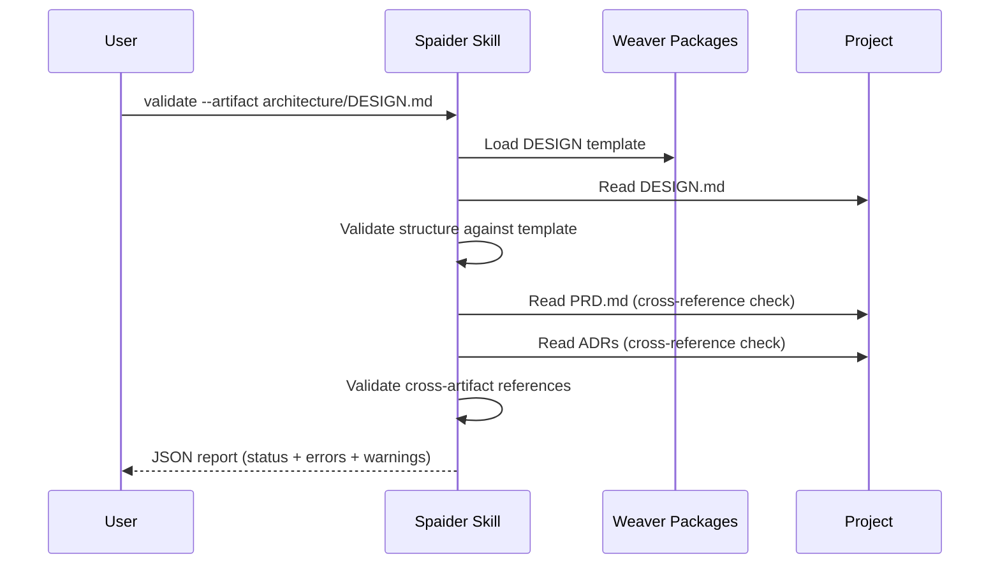
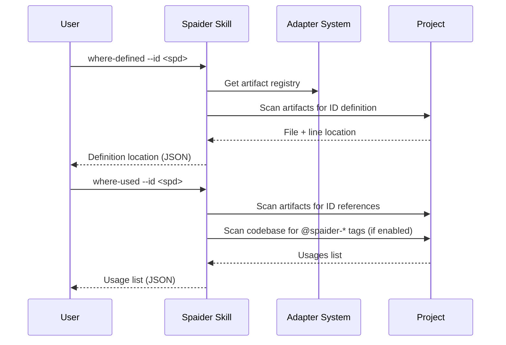

<!-- spd:#:design -->
# Technical Design: Spaider

<!-- spd:##:architecture-overview -->
## 1. Architecture Overview

<!-- spd:###:architectural-vision -->
### Architectural Vision

<!-- spd:architectural-vision-body -->
Spaider employs a **layered architecture with plugin-based extensibility** to provide a technology-agnostic methodology framework. The core methodology layer defines universal workflows and validation rules, while the adapter layer enables project-specific customization without modifying core specifications. This separation ensures that Spaider remains compatible with any technology stack while maintaining consistent design and validation patterns across all projects.

In this design, "Spaider" means **Framework for Documentation and Development** (workflow-centered).

The architecture follows a **flow-driven approach** where users may start from design, implementation, or validation workflows. If required design artifacts are missing, workflows MUST bootstrap them interactively (ask the minimal set of questions needed) and then continue.

Once created, design artifacts become the authoritative traceability source. The validation layer uses a **deterministic gate pattern** where automated validators catch structural issues before expensive manual review, ensuring quality while maximizing efficiency.

AI agent integration is achieved through machine-readable specifications (AGENTS.md navigation, workflow files, requirements) and a skills-based tooling system. The WHEN clause pattern in AGENTS.md files creates a discoverable navigation system where AI agents can autonomously determine which specifications to follow based on the current workflow context.
<!-- spd:architectural-vision-body -->
<!-- spd:###:architectural-vision -->

<!-- spd:###:architecture-drivers -->
### Architecture drivers

<!-- spd:####:prd-requirements -->
#### Product requirements

<!-- spd:fr-title repeat="many" -->
##### FR-001 Workflow-Driven Development

<!-- spd:id-ref:fr has="priority,task" -->
- [x] `p1` - `spd-spaider-fr-workflow-execution`
<!-- spd:id-ref:fr -->

**Solution**: Implement operation/validation workflows as Markdown files in `workflows/*.md`, executed under [`requirements/execution-protocol.md`](../requirements/execution-protocol.md); drive deterministic tool entrypoint via `python3 skills/spaider/scripts/spaider.py <subcommand>`.
<!-- spd:fr-title repeat="many" -->

<!-- spd:fr-title repeat="many" -->
##### FR-002 Artifact Structure Validation

<!-- spd:id-ref:fr has="priority,task" -->
- [x] `p1` - `spd-spaider-fr-validation`
<!-- spd:id-ref:fr -->

**Solution**: Implement validators in `skills/spaider/scripts/spaider/validation/**`; expose via `python3 skills/spaider/scripts/spaider.py validate` with JSON output.
<!-- spd:fr-title repeat="many" -->

<!-- spd:fr-title repeat="many" -->
##### FR-003 Adapter Configuration System

<!-- spd:id-ref:fr has="priority,task" -->
- [x] `p1` - `spd-spaider-fr-adapter-config`
<!-- spd:id-ref:fr -->

**Solution**: Implement adapter discovery via `adapter-info`; apply adapter rules from `{project-root}/.spaider-adapter/AGENTS.md` + `{project-root}/.spaider-adapter/specs/*.md`.
<!-- spd:fr-title repeat="many" -->

<!-- spd:fr-title repeat="many" -->
##### FR-004 Adaptive Design Bootstrapping

<!-- spd:id-ref:fr has="priority,task" -->
- [x] `p1` - `spd-spaider-fr-design-first`
<!-- spd:id-ref:fr -->

**Solution**: Enforce prerequisites-first in workflow specs + execution protocol.
<!-- spd:fr-title repeat="many" -->

<!-- spd:fr-title repeat="many" -->
##### FR-005 Traceability Management

<!-- spd:id-ref:fr has="priority,task" -->
- [x] `p1` - `spd-spaider-fr-traceability`
<!-- spd:id-ref:fr -->

**Solution**: Implement ID scanning via `scan-ids`, `where-defined`, `where-used` subcommands; code traceability via `@spaider-*` tags.
<!-- spd:fr-title repeat="many" -->

<!-- spd:fr-title repeat="many" -->
##### FR-006 Quickstart Guides

<!-- spd:id-ref:fr has="priority,task" -->
- [x] `p2` - `spd-spaider-fr-interactive-docs`
<!-- spd:id-ref:fr -->

**Solution**: Provide CLI/agent-facing onboarding via `QUICKSTART.md` + [`workflows/README.md`](../workflows/README.md).
<!-- spd:fr-title repeat="many" -->

<!-- spd:fr-title repeat="many" -->
##### FR-007 Artifact Templates

<!-- spd:id-ref:fr has="priority,task" -->
- [x] `p1` - `spd-spaider-fr-artifact-templates`
<!-- spd:id-ref:fr -->

**Solution**: Provide templates in `weavers/sdlc/artifacts/{KIND}/template.md`; workflows load weaver packages via `weaver` attribute in the artifacts registry.
<!-- spd:fr-title repeat="many" -->

<!-- spd:fr-title repeat="many" -->
##### FR-008 Artifact Examples

<!-- spd:id-ref:fr has="priority,task" -->
- [x] `p2` - `spd-spaider-fr-artifact-examples`
<!-- spd:id-ref:fr -->

**Solution**: Provide canonical examples in `weavers/sdlc/artifacts/{KIND}/examples/example.md`.
<!-- spd:fr-title repeat="many" -->

<!-- spd:fr-title repeat="many" -->
##### FR-009 ADR Management

<!-- spd:id-ref:fr has="priority,task" -->
- [x] `p2` - `spd-spaider-fr-arch-decision-mgmt`
<!-- spd:id-ref:fr -->

**Solution**: Store ADRs in adapter-defined location; validate via `weavers/sdlc/artifacts/ADR/` weaver package.
<!-- spd:fr-title repeat="many" -->

<!-- spd:fr-title repeat="many" -->
##### FR-010 PRD Management

<!-- spd:id-ref:fr has="priority,task" -->
- [x] `p1` - `spd-spaider-fr-prd-mgmt`
<!-- spd:id-ref:fr -->

**Solution**: Create/update PRD artifact (path defined by adapter registry) via [`workflows/generate.md`](../workflows/generate.md) using weaver guidance from `weavers/sdlc/artifacts/PRD/`; enforce stable IDs.
<!-- spd:fr-title repeat="many" -->

<!-- spd:fr-title repeat="many" -->
##### FR-011 Overall Design Management

<!-- spd:id-ref:fr has="priority,task" -->
- [x] `p1` - `spd-spaider-fr-overall-design-mgmt`
<!-- spd:id-ref:fr -->

**Solution**: Create/update Overall Design artifact (path defined by adapter registry) via [`workflows/generate.md`](../workflows/generate.md) using rules from `weavers/sdlc/artifacts/DESIGN/`.
<!-- spd:fr-title repeat="many" -->

<!-- spd:fr-title repeat="many" -->
##### FR-012 Spec Manifest Management

<!-- spd:id-ref:fr has="priority,task" -->
- [x] `p2` - `spd-spaider-fr-spec-manifest-mgmt`
<!-- spd:id-ref:fr -->

**Solution**: Create/update Spec Manifest artifact (path defined by adapter registry) via [`workflows/generate.md`](../workflows/generate.md) using rules from `weavers/sdlc/artifacts/DECOMPOSITION/`.
<!-- spd:fr-title repeat="many" -->

<!-- spd:fr-title repeat="many" -->
##### FR-013 Spec Design Management

<!-- spd:id-ref:fr has="priority,task" -->
- [x] `p1` - `spd-spaider-fr-spec-design-mgmt`
<!-- spd:id-ref:fr -->

**Solution**: Create/update Spec Design artifact (path defined by adapter registry) via [`workflows/generate.md`](../workflows/generate.md) using rules from `weavers/sdlc/artifacts/SPEC/`.
<!-- spd:fr-title repeat="many" -->

<!-- spd:fr-title repeat="many" -->
##### FR-014 Spec Lifecycle Management

<!-- spd:id-ref:fr has="priority,task" -->
- [x] `p2` - `spd-spaider-fr-spec-lifecycle`
<!-- spd:id-ref:fr -->

**Solution**: Encode lifecycle via manifest status fields + validation gates.
<!-- spd:fr-title repeat="many" -->

<!-- spd:fr-title repeat="many" -->
##### FR-015 Code Generation from Design

<!-- spd:id-ref:fr has="priority,task" -->
- [x] `p2` - `spd-spaider-fr-code-generation`
<!-- spd:id-ref:fr -->

**Solution**: Implement "design-to-code" workflow via [`workflows/generate.md`](../workflows/generate.md) with adapter-defined code generation rules.
<!-- spd:fr-title repeat="many" -->

<!-- spd:fr-title repeat="many" -->
##### FR-016 Brownfield Support

<!-- spd:id-ref:fr has="priority,task" -->
- [x] `p2` - `spd-spaider-fr-brownfield-support`
<!-- spd:id-ref:fr -->

**Solution**: Support legacy projects via adapter discovery and auto-detection.
<!-- spd:fr-title repeat="many" -->

<!-- spd:fr-title repeat="many" -->
##### FR-017 Spaider DSL (SDSL)

<!-- spd:id-ref:fr has="priority,task" -->
- [x] `p1` - `spd-spaider-fr-sdsl`
<!-- spd:id-ref:fr -->

**Solution**: Use Spaider DSL (SDSL) instruction markers in spec design with `ph-N`/`inst-*` tokens.
<!-- spd:fr-title repeat="many" -->

<!-- spd:fr-title repeat="many" -->
##### FR-018 IDE Integration and Tooling

<!-- spd:id-ref:fr has="priority,task" -->
- [ ] `p3` - `spd-spaider-fr-ide-integration`
<!-- spd:id-ref:fr -->

**Solution**: (Planned) VS Code extension with click-to-navigate for Spaider IDs, inline validation, and autocomplete. Currently not implemented.
<!-- spd:fr-title repeat="many" -->

<!-- spd:fr-title repeat="many" -->
##### FR-019 Multi-Agent IDE Integration

<!-- spd:id-ref:fr has="priority,task" -->
- [x] `p2` - `spd-spaider-fr-multi-agent-integration`
<!-- spd:id-ref:fr -->

**Solution**: Generate agent-specific workflow proxies for Claude, Cursor, Windsurf, Copilot.
<!-- spd:fr-title repeat="many" -->

<!-- spd:fr-title repeat="many" -->
##### FR-020 Extensible Weaver Package System

<!-- spd:id-ref:fr has="priority,task" -->
- [x] `p1` - `spd-spaider-fr-rules-packages`
<!-- spd:id-ref:fr -->

**Solution**: Support weaver packages under `weavers/` with `template.md`, `checklist.md`, `rules.md`.
<!-- spd:fr-title repeat="many" -->

<!-- spd:fr-title repeat="many" -->
##### FR-021 Template Quality Assurance

<!-- spd:id-ref:fr has="priority,task" -->
- [x] `p2` - `spd-spaider-fr-template-qa`
<!-- spd:id-ref:fr -->

**Solution**: Provide `self-check` command for template/example validation.
<!-- spd:fr-title repeat="many" -->

<!-- spd:fr-title repeat="many" -->
##### FR-022 Cross-Artifact Validation

<!-- spd:id-ref:fr has="priority,task" -->
- [x] `p1` - `spd-spaider-fr-cross-artifact-validation`
<!-- spd:id-ref:fr -->

**Solution**: Validate `covered_by` references, ID definitions, and checked consistency.
<!-- spd:fr-title repeat="many" -->

<!-- spd:fr-title repeat="many" -->
##### FR-023 Hierarchical System Registry

<!-- spd:id-ref:fr has="priority,task" -->
- [x] `p2` - `spd-spaider-fr-hierarchical-registry`
<!-- spd:id-ref:fr -->

**Solution**: Support `system`, `parent`, `artifacts`, `codebase` in registry; expose via `adapter-info`.
<!-- spd:fr-title repeat="many" -->

<!-- spd:nfr-title repeat="many" -->
##### NFR-001 Validation Performance

<!-- spd:id-ref:nfr has="priority,task" -->
- [x] `p1` - `spd-spaider-nfr-validation-performance`
<!-- spd:id-ref:nfr -->

**Solution**: Use regex-based parsing, scoped filesystem scanning, registry-driven control.
<!-- spd:nfr-title -->

<!-- spd:nfr-title repeat="many" -->
##### NFR-002 Security Integrity

<!-- spd:id-ref:nfr has="priority,task" -->
- [x] `p1` - `spd-spaider-nfr-security-integrity`
<!-- spd:id-ref:nfr -->

**Solution**: Enforce strict parsing and treat unsafe behavior as hard failure.
<!-- spd:nfr-title -->

<!-- spd:nfr-title repeat="many" -->
##### NFR-003 Reliability Recoverability

<!-- spd:id-ref:nfr has="priority,task" -->
- [x] `p1` - `spd-spaider-nfr-reliability-recoverability`
<!-- spd:id-ref:nfr -->

**Solution**: Include paths/lines and deterministic remediation guidance.
<!-- spd:nfr-title -->

<!-- spd:nfr-title repeat="many" -->
##### NFR-004 Adoption Usability

<!-- spd:id-ref:nfr has="priority,task" -->
- [x] `p2` - `spd-spaider-nfr-adoption-usability`
<!-- spd:id-ref:nfr -->

**Solution**: Templates and validation messages minimize required context.
<!-- spd:nfr-title -->
<!-- spd:####:prd-requirements -->

<!-- spd:####:adr-records -->
#### Architecture Decisions Records

<!-- spd:adr-title -->
##### ADR-001 Initial Architecture

<!-- spd:id-ref:adr has="priority,task" -->
- [x] `p1` - `spd-spaider-adr-initial-architecture-v1`
<!-- spd:id-ref:adr -->

Establishes the initial layered architecture and repository structure for Spaider, including the separation between methodology core, adapter-owned specs, workflows, and deterministic validation.
<!-- spd:adr-title -->

<!-- spd:adr-title -->
##### ADR-002 Adaptive Framework for Documentation and Development

<!-- spd:id-ref:adr has="priority,task" -->
- [x] `p1` - `spd-spaider-adr-adaptive-spaider-flow-driven-development-v1`
<!-- spd:id-ref:adr -->

Formalizes the "adaptive"/flow-driven execution model where workflows validate prerequisites, bootstrap missing artifacts, and then continue, rather than failing early.
<!-- spd:adr-title -->

<!-- spd:adr-title -->
##### ADR-003 Template-Centric Architecture

<!-- spd:id-ref:adr has="priority,task" -->
- [x] `p1` - `spd-spaider-adr-template-centric-architecture-v1`
<!-- spd:id-ref:adr -->

Introduces template-centric architecture where templates become self-contained packages with workflows, checklists, and requirements.
<!-- spd:adr-title -->
<!-- spd:####:adr-records -->
<!-- spd:###:architecture-drivers -->

<!-- spd:###:architecture-layers -->
### Architecture Layers

<!-- spd:table:architecture-layers -->
| Layer | Responsibility | Technology |
|-------|---------------|------------|
| Methodology Core Layer | Defines universal Spaider content requirements, workflow specifications, and base AGENTS.md navigation rules. Technology-agnostic and stable across all projects. | Markdown (specifications), Python 3 standard library (tooling) |
| Adapter Layer | Project-specific customization through adapter AGENTS.md with Extends mechanism. Contains tech stack definitions, domain model format specs, API contract formats, testing strategies, coding conventions, and the adapter-owned artifact registry for artifact discovery. | JSON (configuration), Markdown (specifications) |
| Validation Layer | Deterministic validators implemented in `spaider` skill for structural validation. Includes ID format checking, cross-reference validation, placeholder detection, and code traceability verification. | Python 3 standard library (validators), JSON (reports) |
| Workflow Layer | Executable procedures for creating and validating artifacts. Operation workflows (interactive) for artifact creation/update, validation workflows (automated) for quality checks. Spaider DSL (SDSL) provides plain-English algorithm descriptions. | Markdown (workflows), Spaider DSL (SDSL) (algorithms) |
| AI Integration Layer | WHEN clause navigation system, skills-based tooling, and deterministic gate pattern for AI agent execution. Enables autonomous workflow execution with minimal human intervention. | Markdown (AGENTS.md), Python 3 (skills), JSON (skill I/O) |
<!-- spd:table:architecture-layers -->
<!-- spd:###:architecture-layers -->
<!-- spd:##:architecture-overview -->

---

<!-- spd:##:principles-and-constraints -->
## 2. Principles & Constraints

<!-- spd:###:principles -->
### 2.1: Design Principles

<!-- spd:####:principle-title repeat="many" -->
#### Technology-agnostic core

<!-- spd:id:principle has="priority,task" covered_by="DECOMPOSITION,SPEC" -->
- [x] `p1` - **ID**: `spd-spaider-principle-tech-agnostic`

<!-- spd:paragraph:principle-body -->
Keep the Spaider core methodology and tooling independent of any particular programming language or framework. Project-specific technology choices belong in the adapter layer.
<!-- spd:paragraph:principle-body -->
<!-- spd:id:principle -->
<!-- spd:####:principle-title -->

<!-- spd:####:principle-title repeat="many" -->
#### Design before code

<!-- spd:id:principle has="priority,task" covered_by="DECOMPOSITION,SPEC" -->
- [x] `p1` - **ID**: `spd-spaider-principle-design-first`

<!-- spd:paragraph:principle-body -->
Treat validated design artifacts as the single source of truth. Workflows must validate prerequisites before proceeding, and bootstrap missing prerequisites when appropriate.
<!-- spd:paragraph:principle-body -->
<!-- spd:id:principle -->
<!-- spd:####:principle-title -->

<!-- spd:####:principle-title repeat="many" -->
#### Machine-readable specifications

<!-- spd:id:principle has="priority,task" covered_by="DECOMPOSITION,SPEC" -->
- [x] `p1` - **ID**: `spd-spaider-principle-machine-readable`

<!-- spd:paragraph:principle-body -->
Prefer formats and conventions that can be parsed deterministically (stable IDs, structured headings, tables, payload blocks) so validation and traceability can be automated.
<!-- spd:paragraph:principle-body -->
<!-- spd:id:principle -->
<!-- spd:####:principle-title -->

<!-- spd:####:principle-title repeat="many" -->
#### Deterministic gate

<!-- spd:id:principle has="priority,task" covered_by="DECOMPOSITION,SPEC" -->
- [x] `p1` - **ID**: `spd-spaider-principle-deterministic-gate`

<!-- spd:paragraph:principle-body -->
Always run deterministic validation before manual review or implementation steps. Treat validator output as authoritative for structural correctness.
<!-- spd:paragraph:principle-body -->
<!-- spd:id:principle -->
<!-- spd:####:principle-title -->

<!-- spd:####:principle-title repeat="many" -->
#### Traceability by design

<!-- spd:id:principle has="priority,task" covered_by="DECOMPOSITION,SPEC" -->
- [x] `p1` - **ID**: `spd-spaider-principle-traceability`

<!-- spd:paragraph:principle-body -->
Use stable IDs and cross-references across artifacts (and optional code tags) to support impact analysis and auditing from PRD to design to implementation.
<!-- spd:paragraph:principle-body -->
<!-- spd:id:principle -->
<!-- spd:####:principle-title -->

<!-- spd:####:principle-title repeat="many" -->
#### Prefer stable, machine-readable, text-based artifacts

<!-- spd:id:principle has="priority,task" covered_by="DECOMPOSITION,SPEC" -->
- [x] `p1` - **ID**: `spd-spaider-principle-machine-readable-artifacts`

<!-- spd:paragraph:principle-body -->
Keep normative artifacts as stable, plain-text sources of truth that can be parsed deterministically. Prefer Markdown + structured conventions (IDs, tables, payload blocks) so both humans and tools can reliably consume and validate the content.
<!-- spd:paragraph:principle-body -->
<!-- spd:id:principle -->
<!-- spd:####:principle-title -->

<!-- spd:####:principle-title repeat="many" -->
#### Prefer variability isolation via adapters over core changes

<!-- spd:id:principle has="priority,task" covered_by="DECOMPOSITION,SPEC" -->
- [x] `p1` - **ID**: `spd-spaider-principle-adapter-variability-boundary`

<!-- spd:paragraph:principle-body -->
Keep project-specific variability (tech stack, domain model format, API contracts, conventions) in the adapter layer. Avoid modifying core methodology/specs for project needs; instead, use Extends + adapter specs so the core remains generic and reusable.
<!-- spd:paragraph:principle-body -->
<!-- spd:id:principle -->
<!-- spd:####:principle-title -->

<!-- spd:####:principle-title repeat="many" -->
#### Prefer composable CLI+JSON interfaces

<!-- spd:id:principle has="priority,task" covered_by="DECOMPOSITION,SPEC" -->
- [x] `p1` - **ID**: `spd-spaider-principle-cli-json-composability`

<!-- spd:paragraph:principle-body -->
Expose deterministic tooling via a CLI with stable JSON output for composition in CI/CD and IDE integrations. Prefer small, single-purpose commands that can be chained and automated.
<!-- spd:paragraph:principle-body -->
<!-- spd:id:principle -->
<!-- spd:####:principle-title -->
<!-- spd:###:principles -->

<!-- spd:###:constraints -->
### 2.2: Constraints

<!-- spd:####:constraint-title repeat="many" -->
#### Constraint 1: Python Standard Library Only

<!-- spd:id:constraint has="priority,task" covered_by="DECOMPOSITION,SPEC" -->
- [x] `p1` - **ID**: `spd-spaider-constraint-stdlib-only`

<!-- spd:paragraph:constraint-body -->
The `spaider` validation tool MUST use only Python 3.6+ standard library. No external dependencies (pip packages) are permitted in core tooling. This constraint ensures Spaider can run anywhere Python is available without complex installation or dependency management. Adapters may use any dependencies for project-specific code generation.
<!-- spd:paragraph:constraint-body -->
<!-- spd:id:constraint -->
<!-- spd:####:constraint-title -->

<!-- spd:####:constraint-title repeat="many" -->
#### Constraint 2: Markdown-Only Artifacts

<!-- spd:id:constraint has="priority,task" covered_by="DECOMPOSITION,SPEC" -->
- [x] `p1` - **ID**: `spd-spaider-constraint-markdown`

<!-- spd:paragraph:constraint-body -->
All Spaider artifacts (PRD, Overall Design, ADRs, Spec Manifest, etc.) MUST be plain Markdown. No binary formats, proprietary tools, or custom file formats permitted. This constraint ensures artifacts are version-controllable, diffable, and editable in any text editor. Domain models and API contracts referenced by artifacts may be in any format (specified by adapter).
<!-- spd:paragraph:constraint-body -->
<!-- spd:id:constraint -->
<!-- spd:####:constraint-title -->

<!-- spd:####:constraint-title repeat="many" -->
#### Constraint 3: Git-Based Workflow

<!-- spd:id:constraint has="priority,task" covered_by="DECOMPOSITION,SPEC" -->
- [x] `p1` - **ID**: `spd-spaider-constraint-git`

<!-- spd:paragraph:constraint-body -->
Spaider assumes Git version control for artifact history and collaboration. Change tracking relies on Git commits and diffs. Spec branches and pull requests are the collaboration model. This constraint aligns Spaider with modern development practices but requires Git knowledge from users.
<!-- spd:paragraph:constraint-body -->
<!-- spd:id:constraint -->
<!-- spd:####:constraint-title -->

<!-- spd:####:constraint-title repeat="many" -->
#### Constraint 4: No Forced Tool Dependencies

<!-- spd:id:constraint has="priority,task" covered_by="DECOMPOSITION,SPEC" -->
- [x] `p1` - **ID**: `spd-spaider-constraint-no-forced-tools`

<!-- spd:paragraph:constraint-body -->
Spaider core MUST NOT require specific IDEs, editors, or development tools. Validation MUST run from command line without GUI tools. IDE integrations are optional enhancements, not requirements. This constraint ensures Spaider works in any development environment (local, remote, CI/CD, etc.).
<!-- spd:paragraph:constraint-body -->
<!-- spd:id:constraint -->
<!-- spd:####:constraint-title -->
<!-- spd:###:constraints -->
<!-- spd:##:principles-and-constraints -->

---

<!-- spd:##:technical-architecture -->
## 3. Technical Architecture

<!-- spd:###:domain-model -->
### 3.1: Domain Model

<!-- spd:paragraph:domain-model -->
**Technology**: Markdown-based artifacts (not code-level types) + JSON Schema (machine-readable contracts)

**Specifications**:
- Weaver packages (templates, checklists, rules, examples): [`weavers/sdlc/artifacts/{KIND}/`](../weavers/sdlc/artifacts/)
- Template syntax: [`requirements/template.md`](../requirements/template.md)
- Rules format: [`requirements/rules-format.md`](../requirements/rules-format.md)
- Spaider DSL (SDSL) (behavior language): [`requirements/SDSL.md`](../requirements/SDSL.md)
- Artifact registry: [`requirements/artifacts-registry.md`](../requirements/artifacts-registry.md)
- Code traceability: [`requirements/traceability.md`](../requirements/traceability.md)

**Schemas** (machine-readable):
- Artifact registry: [`schemas/artifacts.schema.json`](../schemas/artifacts.schema.json)
- Template frontmatter: [`schemas/spaider-template-frontmatter.schema.json`](../schemas/spaider-template-frontmatter.schema.json)

**CLI Tool**:
- CLISPEC: [`skills/spaider/spaider.clispec`](../skills/spaider/spaider.clispec)
- SKILL: [`skills/spaider/SKILL.md`](../skills/spaider/SKILL.md)

**Core Entities**:

**Artifacts**:
- PRD: Vision, Actors, Capabilities, Use Cases
- Overall Design: Architecture, Requirements, Technical Details
- ADRs: MADR-formatted decision records
- Spec Manifest: Spec list with status tracking
- Spec Design: Spec specifications with flows, algorithms, states

**IDs** (format: `spd-{system}-{kind}-{slug}`):

*PRD Artifact*:
- Actor: `spd-{system}-actor-{slug}`
- Use Case: `spd-{system}-usecase-{slug}`
- Functional Requirement: `spd-{system}-fr-{slug}`
- Non-Functional Requirement: `spd-{system}-nfr-{slug}`

*DESIGN Artifact*:
- Principle: `spd-{system}-principle-{slug}`
- Constraint: `spd-{system}-constraint-{slug}`
- Component: `spd-{system}-component-{slug}`
- Sequence: `spd-{system}-seq-{slug}`
- DB Table: `spd-{system}-dbtable-{slug}`
- Topology: `spd-{system}-topology-{slug}`

*ADR Artifact*:
- ADR: `spd-{system}-adr-{slug}`

*DECOMPOSITION Artifact*:
- Spec: `spd-{system}-spec-{slug}`

*SPEC Artifact* (nested under spec):
- Flow: `spd-{system}-spec-{spec}-flow-{slug}`
- Algorithm: `spd-{system}-spec-{spec}-algo-{slug}`
- State: `spd-{system}-spec-{spec}-state-{slug}`
- Spec Requirement: `spd-{system}-spec-{spec}-req-{slug}`
- Spec Context: `spd-{system}-spec-{spec}-speccontext-{slug}`

All IDs MAY be versioned by appending a `-vN` suffix (e.g., `spd-{system}-adr-{slug}-v2`).

**Workflows**:
- Operation workflow (Type: Operation): Interactive artifact creation/update
- Validation workflow (Type: Validation): Automated quality checks

**Relationships**:
- PRD defines Actors, Use Cases, FRs, and NFRs
- Overall Design references FRs/NFRs/ADRs and defines Principles, Constraints, Components, Sequences
- Spec Manifest lists Specs and references design elements
- Spec Design defines Flows, Algorithms, States for a specific Spec
- ADRs are referenced by DESIGN and document architectural decisions

**CRITICAL**: Domain model is expressed in Markdown artifacts, not programming language types. Validation checks artifacts against requirements files, not type compilation.
<!-- spd:paragraph:domain-model -->
<!-- spd:###:domain-model -->

<!-- spd:###:component-model -->
### 3.2: Component Model

The Spaider system consists of 6 core components + 1 external (Project) with the following interactions:

<!-- spd:code:component-model -->

**Legend**: `==>` invokes (runtime call) | `-->` reads (data flow) | `-.->` depends (design-time)
<!-- spd:code:component-model -->

**Component Descriptions**:

<!-- spd:####:component-title repeat="many" -->
#### 1. Methodology Core

<!-- spd:id:component has="priority,task" covered_by="DECOMPOSITION,SPEC" -->
- [x] `p1` - **ID**: `spd-spaider-component-methodology-core`

<!-- spd:list:component-payload -->
- Contains universal Spaider specifications (requirements files, workflow files, core AGENTS.md)
- Provides workflow templates (workflows/*.md)
- Technology-agnostic and stable across all projects
- Embedded in Project: copied or linked into project directory
- Location: configurable via adapter (typically `{project}/requirements/`, `{project}/workflows/`)
<!-- spd:list:component-payload -->
<!-- spd:id:component -->
<!-- spd:####:component-title -->

<!-- spd:####:component-title repeat="many" -->
#### 2. Adapter System

<!-- spd:id:component has="priority,task" covered_by="DECOMPOSITION,SPEC" -->
- [x] `p1` - **ID**: `spd-spaider-component-adapter-system`

<!-- spd:list:component-payload -->
- Project-specific customization layer, embedded in Project
- Adapter AGENTS.md extends core AGENTS.md via **Extends** mechanism
- Spec files define tech stack, domain model format, API contracts, conventions
- Adapter-owned `artifacts.json` defines artifact discovery rules and can register project-specific weaver packages
- Auto-detection capability for existing codebases
- Location: `<project>/.spaider-adapter/`
<!-- spd:list:component-payload -->
<!-- spd:id:component -->
<!-- spd:####:component-title -->

<!-- spd:####:component-title repeat="many" -->
#### 3. Weaver Packages

<!-- spd:id:component has="priority,task" covered_by="DECOMPOSITION,SPEC" -->
- [x] `p1` - **ID**: `spd-spaider-component-rules-packages`

<!-- spd:list:component-payload -->
- Template definitions for each artifact kind (`template.md`)
- Semantic validation checklists (`checklist.md`)
- Generation guidance (`rules.md`)
- Canonical examples (`weavers/sdlc/artifacts/{KIND}/examples/example.md`)
- **Extensible**: Projects can register custom weaver packages via adapter
- Location: Spaider distribution `weavers/sdlc/artifacts/{KIND}/` + project-specific paths
<!-- spd:list:component-payload -->
<!-- spd:id:component -->
<!-- spd:####:component-title -->

<!-- spd:####:component-title repeat="many" -->
#### 4. Spaider Skill

<!-- spd:id:component has="priority,task" covered_by="DECOMPOSITION,SPEC" -->
- [x] `p1` - **ID**: `spd-spaider-component-spaider-skill`

<!-- spd:list:component-payload -->
- CLI tool providing all deterministic operations (`skills/spaider/scripts/spaider.py`)
- **Validation**: Structural checks, ID formats, cross-references, placeholders
- **Traceability**: ID scanning (`list-ids`, `where-defined`, `where-used`), code tags (`@spaider-*`)
- **Init**: Initializes adapter (`init`), generates workflow and skill proxies (`agents`)
- Reads artifacts via Adapter System, parses by Weaver Packages
- Output is JSON for machine consumption
<!-- spd:list:component-payload -->
<!-- spd:id:component -->
<!-- spd:####:component-title -->

<!-- spd:####:component-title repeat="many" -->
#### 5. Workflows

<!-- spd:id:component has="priority,task" covered_by="DECOMPOSITION,SPEC" -->
- [x] `p1` - **ID**: `spd-spaider-component-workflows`

<!-- spd:list:component-payload -->
- Operation workflows: Interactive artifact creation/update
- Validation workflows: Automated quality checks
- SDSL processing: Plain-English algorithms with instruction markers
- Question-answer flow with context-based proposals
- Execution protocol: Prerequisites check → Specification reading → Interactive input → Content generation → Validation
<!-- spd:list:component-payload -->
<!-- spd:id:component -->
<!-- spd:####:component-title -->

<!-- spd:####:component-title repeat="many" -->
#### 6. Agent

<!-- spd:id:component has="priority,task" covered_by="DECOMPOSITION,SPEC" -->
- [x] `p1` - **ID**: `spd-spaider-component-agent`

<!-- spd:list:component-payload -->
- LLM + system prompts (AGENTS.md navigation rules)
- WHEN clause rules determine which specs to follow
- Skills system: Claude-compatible tools (spaider skill, future extensions)
- Deterministic gate pattern: Automated validators run before manual review
- Machine-readable specifications enable autonomous execution
<!-- spd:list:component-payload -->
<!-- spd:id:component -->
<!-- spd:####:component-title -->

#### 7. Project (External)

- Target system where Spaider is applied
- Contains real artifacts (PRD, DESIGN, ADRs, DECOMPOSITION, SPECs)
- Contains implementation code with optional `@spaider-*` traceability tags
- Contains `.spaider-config` created by Spaider Skill `init` command
- Agent reads artifacts and code to understand context
- Agent writes artifacts and code during workflow execution
- Spaider Skill validates artifacts and scans code for traceability

#### Workflow Execution Model

Spaider treats the primary user interaction as **workflow execution**.

The system provides two workflow types:
- **Operation workflows**: interactively create/update artifacts using a question-answer loop with proposals and explicit user confirmation before writing.
- **Validation workflows**: validate artifacts deterministically and output results to chat only (no file writes).

Execution sequence (conceptual, shared across workflows):
1. Resolve user intent to a workflow.
2. Discover adapter configuration (if present).
3. Validate prerequisites (required artifacts exist and are already validated to threshold).
4. Execute the workflow:
  - Operation: collect inputs → update artifact → run validation.
  - Validation: deterministic gate first → manual/LLM-heavy checks next.

The deterministic gate is provided by the `spaider` tool and MUST be treated as authoritative for structural validity.

#### Unix-way Alignment

Spaider follows Unix-way principles for tooling:
- Prefer small, single-purpose commands (validate, list, search, trace).
- Prefer composable interfaces (CLI + JSON output) for CI/CD and IDE integrations.
- Keep stable, text-based, version-controlled inputs (Markdown artifacts, CLISPEC).
- Keep project-specific variability isolated in the adapter layer, not in the core.

#### `spaider` Tool Execution Model

The `spaider` tool is the deterministic interface used by workflows, CI, and IDE integrations.

Design contract:
- Single, agent-safe entrypoint: `python3 skills/spaider/scripts/spaider.py`.
- Command surface is specified in CLISPEC (`skills/spaider/spaider.clispec`).
- Output is JSON for machine consumption.
- The tool provides:
  - Deterministic validation of artifacts and cross-references.
  - Repository-wide search and traceability queries (`list-ids`, `where-defined`, `where-used`).
  - Adapter discovery (`adapter-info`).
<!-- spd:###:component-model -->

<!-- spd:###:api-contracts -->
### 3.3: API Contracts

<!-- spd:paragraph:api-contracts -->
**Technology**: CLISPEC for command-line interface (spaider tool)

**Location**:
- Format specification: [`CLISPEC.md`](../CLISPEC.md)
- Command specification: [`skills/spaider/spaider.clispec`](../skills/spaider/spaider.clispec)
- Implementation: [`skills/spaider/scripts/spaider.py`](../skills/spaider/scripts/spaider.py)

**Commands Overview**:

**Validation**:
- `validate [--artifact <path>]`: Validate artifact structure against template
- `validate-weavers [--weaver <id>]`: Validate weaver packages and templates
- `validate-code [path]`: Validate code traceability markers

**Search & Traceability**:
- `list-ids [--artifact <path>] [--pattern <str>] [--kind <str>]`: List all Spaider IDs
- `list-id-kinds [--artifact <path>]`: List ID kinds with counts
- `get-content --artifact <path> --id <id>`: Get content block for ID
- `where-defined --id <id>`: Find where ID is defined
- `where-used --id <id>`: Find all references to ID

**Adapter & Agent Integration**:
- `adapter-info [--root <path>]`: Discover adapter configuration
- `init [--project-root <path>]`: Initialize Spaider adapter
- `agents --agent <name>`: Generate agent workflow proxies and skill outputs
- `self-check [--weaver <id>]`: Validate examples against templates

**CRITICAL**: API contracts are CLISPEC format (command-line interface specification), not REST/HTTP. All commands output JSON for machine consumption.
<!-- spd:paragraph:api-contracts -->
<!-- spd:###:api-contracts -->

<!-- spd:###:interactions -->
### 3.4: Interactions & Sequences

<!-- spd:####:sequence-title repeat="many" -->
#### Resolve user intent to a workflow (operation + deterministic gate)

<!-- spd:id:seq has="priority,task" covered_by="DECOMPOSITION,SPEC" -->
- [x] `p1` - **ID**: `spd-spaider-seq-intent-to-workflow`

<!-- spd:code:sequences -->

<!-- spd:code:sequences -->

<!-- spd:paragraph:sequence-body -->
**Components**: Agent, Workflows, Weaver Packages, Spaider Skill, Project

**Failure modes / error paths**:
- If adapter navigation prerequisites are missing (e.g., no `{project-root}/.spaider-adapter/AGENTS.md`), the Agent MUST stop and ask the user to initialize or point to the correct project root.
- If the deterministic gate returns `FAIL`, the Agent MUST NOT write artifacts; it reports the validator errors and requests confirmation before re-running.
- If a required workflow or weaver file is missing or unreadable, the Agent reports the missing dependency and does not continue the workflow.

**Actors**: `spd-spaider-actor-product-manager`, `spd-spaider-actor-architect`, `spd-spaider-actor-ai-assistant`, `spd-spaider-actor-spaider-tool`
<!-- spd:paragraph:sequence-body -->
<!-- spd:id:seq -->
<!-- spd:####:sequence-title -->

<!-- spd:####:sequence-title repeat="many" -->
#### Discover adapter configuration (before applying project-specific conventions)

<!-- spd:id:seq has="priority,task" covered_by="DECOMPOSITION,SPEC" -->
- [x] `p1` - **ID**: `spd-spaider-seq-adapter-discovery`

<!-- spd:code:sequences -->

<!-- spd:code:sequences -->

<!-- spd:paragraph:sequence-body -->
**Components**: Agent, Spaider Skill, Project, Adapter System

**Failure modes / error paths**:
- If no adapter is found, `adapter-info` returns a `NOT_FOUND` status; the Agent proceeds only with explicit user confirmation (no silent assumptions about conventions).
- If adapter registry files are malformed (e.g., invalid JSON), `adapter-info` returns an error; the Agent stops and requests the registry be fixed before continuing.
- If the selected root is wrong, the Agent asks the user to confirm the intended project root and re-runs discovery.

**Actors**: `spd-spaider-actor-technical-lead`, `spd-spaider-actor-ai-assistant`
<!-- spd:paragraph:sequence-body -->
<!-- spd:id:seq -->
<!-- spd:####:sequence-title -->

<!-- spd:####:sequence-title repeat="many" -->
#### Validate overall design against requirements (deterministic validation workflow)

<!-- spd:id:seq has="priority,task" covered_by="DECOMPOSITION,SPEC" -->
- [x] `p1` - **ID**: `spd-spaider-seq-validate-overall-design`

<!-- spd:code:sequences -->

<!-- spd:code:sequences -->

<!-- spd:paragraph:sequence-body -->
**Components**: Spaider Skill, Weaver Packages, Project

**Failure modes / error paths**:
- If the artifact does not match the template (missing required sections/markers), validation returns `FAIL` with a structured error list.
- If cross-artifact references are missing (e.g., referenced IDs/paths not found), validation returns `FAIL` with the unresolved references.
- If the weaver package or template cannot be loaded, validation returns `FAIL` (missing dependency) and does not attempt partial validation.

**Actors**: `spd-spaider-actor-architect`, `spd-spaider-actor-spaider-tool`
<!-- spd:paragraph:sequence-body -->
<!-- spd:id:seq -->
<!-- spd:####:sequence-title -->

<!-- spd:####:sequence-title repeat="many" -->
#### Trace requirement/use case to implementation (repository-wide queries)

<!-- spd:id:seq has="priority,task" covered_by="DECOMPOSITION,SPEC" -->
- [x] `p1` - **ID**: `spd-spaider-seq-traceability-query`

<!-- spd:code:sequences -->

<!-- spd:code:sequences -->

<!-- spd:paragraph:sequence-body -->
**Components**: Spaider Skill, Adapter System, Project

**Failure modes / error paths**:
- If the adapter registry is missing/unreadable, queries return an error (no silent fallback for registry-scoped lookups).
- If an ID is not found, the command returns an empty result set (or explicit "not found" status), allowing callers to distinguish absence from errors.
- If code scanning is disabled or unsupported for the project, `where-used` omits code references and reports only artifact references.

**Actors**: `spd-spaider-actor-developer`, `spd-spaider-actor-spaider-tool`
<!-- spd:paragraph:sequence-body -->
<!-- spd:id:seq -->
<!-- spd:####:sequence-title -->
<!-- spd:###:interactions -->

<!-- spd:###:database -->
### 3.5: Database schemas & tables (optional)

<!-- spd:####:db-table-title repeat="many" -->
#### N/A

<!-- spd:id:dbtable has="priority,task" covered_by="DECOMPOSITION,SPEC" -->
- [x] `p3` - **ID**: `spd-spaider-dbtable-na`

Not applicable — Spaider is a methodology framework that does not maintain its own database. Artifact data is stored in plain Markdown files and JSON configuration.

<!-- spd:table:db-table-schema -->
| Column | Type | Description |
|--------|------|-------------|
| N/A | N/A | No database tables |
<!-- spd:table:db-table-schema -->

<!-- spd:table:db-table-example -->
| N/A | N/A | N/A |
|-----|-----|-----|
| N/A | N/A | N/A |
<!-- spd:table:db-table-example -->
<!-- spd:id:dbtable -->
<!-- spd:####:db-table-title -->
<!-- spd:###:database -->

<!-- spd:###:topology -->
### 3.6: Topology (optional)

<!-- spd:id:topology has="task" -->
- [x] `p3` - **ID**: `spd-spaider-topology-local`

<!-- spd:free:topology-body -->
Not applicable — Spaider runs locally on developer machines. No cloud infrastructure, containers, or distributed deployment required. The `spaider` CLI tool executes directly via Python interpreter.
<!-- spd:free:topology-body -->
<!-- spd:id:topology -->
<!-- spd:###:topology -->

<!-- spd:###:tech-stack -->
### 3.7: Tech stack (optional)

<!-- spd:paragraph:status -->
**Status**: Accepted
<!-- spd:paragraph:status -->

<!-- spd:paragraph:tech-body -->
- **Runtime**: Python 3.6+ standard library only
- **Configuration**: JSON (artifacts.json, .spaider-config.json)
- **Documentation**: Markdown (all artifacts, workflows, specs)
- **Version Control**: Git (assumed for artifact history)
<!-- spd:paragraph:tech-body -->
<!-- spd:###:tech-stack -->
<!-- spd:##:technical-architecture -->

---

<!-- spd:##:design-context -->
## 4. Additional Context

<!-- spd:free:design-context-body -->
Additional notes and rationale for the Spaider overall design.

### Technology Selection Rationale

**Python 3 Standard Library Only**: Chosen for maximum portability and zero installation complexity. Python 3.6+ is available on most development machines. Standard library ensures no dependency management or version conflicts.

**Markdown for Artifacts**: Universal format compatible with all editors, version control systems, and documentation platforms. Plain text ensures longevity and accessibility. Syntax highlighting and rendering available in all modern development tools.

**CLISPEC for API**: Command-line interface is most compatible with CI/CD pipelines, remote development, and automation scripts. JSON output enables machine consumption and integration with other tools.

**GTS for Spaider's Own Domain Model**: While Spaider supports any domain model format via adapters, Spaider itself uses GTS (Global Type System) for domain type definitions as a demonstration of machine-readable specifications.

### Domain Applicability (Checklist)

This DESIGN describes a local CLI tool / methodology framework. Domains that are not applicable are explicitly marked with rationale so reviewers can distinguish "not applicable" from "omitted".

| Domain | Disposition | Notes / Where Addressed |
|---|---|---|
| ARCH | Addressed | Sections 1–3 (overview, components, contracts, sequences) |
| MAINT | Addressed | Sections 2–3 + Tech stack rationale (Section 3.7 + this section) |
| TEST | Addressed | Deterministic validation workflow (3.4) + repository tests (`tests/`) |
| DATA | Addressed (no DB) | DB explicitly N/A (3.5); artifacts are Markdown + JSON config (3.7) |
| INT | Addressed (repo-local) | Adapter discovery + registry-driven conventions (3.4) |
| SEC | Addressed (local-only) | No network service; no runtime dependency execution; failure paths + deterministic validation (3.4) |
| REL | Addressed (tool-level) | Deterministic validation + explicit failure modes (3.4) |
| PERF | Limited / non-goal | Not applicable for throughput/latency SLAs because this is a local CLI tool; performance considerations are limited to repo scan cost (noted in Future Improvements) |
| OPS | Not applicable | Not applicable — there is no deployed service topology (3.6). No runtime operations, paging, or SRE on-call model applies. |
| COMPL | Not applicable | Not applicable — Spaider does not process regulated or personal customer data; artifacts are project documentation stored in-repo. |
| UX | Addressed (CLI) | CLI contracts + JSON output for automation (3.3); human UX is via editor/terminal tooling |
| BIZ | Addressed | PRD/requirements linkage and traceability intent (Sections 1–3) |

### Implementation Considerations

**Incremental Adoption Path**:
- Teams commonly start with a minimal adapter (`Extends: ...`) and then add PRD + DESIGN to establish shared intent and a deterministic validation target.
- ADRs and DECOMPOSITION/SPEC artifacts can be introduced later as decisions and traceability needs grow.
- Adapter conventions typically evolve over time as repeatable patterns emerge.

**Migration from Existing Projects**:
- Use `adapter-from-sources` to bootstrap a starting adapter from the existing repository.
- Capture product intent in PRD from the current requirements source of truth.
- Summarize the current architecture in DESIGN, focusing on stable components, interfaces, and invariants.
- Expand traceability incrementally (new/changed areas first), without blocking on full backfill.

**AI Agent Best Practices**:
 - Always run `spaider adapter-info` before starting any workflow
 - Use deterministic gate (spaider validate) before manual validation
 - Follow execution-protocol.md for all workflow executions
 - Use spaider skill for artifact search and ID lookup
 - Never skip prerequisites validation

### Artifact Lifecycle Map

The following table summarizes which weaver packages provide templates and validation for each artifact kind. Artifact paths are defined by the adapter registry, not hardcoded.

| Artifact Kind | Weaver Package | Create/Update | Validate |
|---|---|---|---|
| PRD | `weavers/sdlc/artifacts/PRD/` | [`workflows/generate.md`](../workflows/generate.md) | [`workflows/analyze.md`](../workflows/analyze.md) |
| DESIGN | `weavers/sdlc/artifacts/DESIGN/` | [`workflows/generate.md`](../workflows/generate.md) | [`workflows/analyze.md`](../workflows/analyze.md) |
| ADR | `weavers/sdlc/artifacts/ADR/` | [`workflows/generate.md`](../workflows/generate.md) | [`workflows/analyze.md`](../workflows/analyze.md) |
| DECOMPOSITION | `weavers/sdlc/artifacts/DECOMPOSITION/` | [`workflows/generate.md`](../workflows/generate.md) | [`workflows/analyze.md`](../workflows/analyze.md) |
| SPEC | `weavers/sdlc/artifacts/SPEC/` | [`workflows/generate.md`](../workflows/generate.md) | [`workflows/analyze.md`](../workflows/analyze.md) |

All artifact kinds use the same generic workflows (`generate.md` for creation/update, `analyze.md` for validation/analysis). The artifact kind and path are determined by the adapter registry and selected via the `/spaider` entrypoint.

### Global Specification Contracts

Spaider avoids duplicating requirements across artifacts. The following files are the authoritative contracts that workflows and artifacts MUST follow:

 - Execution protocol: [requirements/execution-protocol.md](../requirements/execution-protocol.md)
 - Generate workflow: [workflows/generate.md](../workflows/generate.md)
 - Validate workflow: [workflows/analyze.md](../workflows/analyze.md)
 - Rules format: [requirements/rules-format.md](../requirements/rules-format.md)
 - Template syntax specification: [requirements/template.md](../requirements/template.md)
 - Weaver packages (templates, checklists, rules, examples): [weavers/sdlc/artifacts/](../weavers/sdlc/artifacts/)

### Future Technical Improvements

**Performance Optimizations**:
 - Caching for repository-wide ID scans (currently re-scans on each query)
 - Incremental validation (only validate changed sections)
 - Parallel processing for multi-artifact validation

**Enhanced Traceability**:
 - Visual traceability graphs (actor → capability → requirement → code)
 - Impact analysis UI (show all affected artifacts when changing design)
 - Coverage metrics dashboard (% of requirements implemented, tested)

**IDE Integration Enhancements**:
 - Language server protocol (LSP) for real-time validation
 - Quick fixes for common validation errors
 - Hover tooltips showing ID definitions
 - Auto-completion for Spaider IDs and references

**Adapter Ecosystem**:
 - Public adapter registry for common tech stacks
 - Adapter composition (extend multiple adapters)
 - Adapter versioning and compatibility checking
 - Community-contributed patterns and templates
<!-- spd:free:design-context-body -->

<!-- spd:paragraph:date -->
**Date**: 2025-01-17
<!-- spd:paragraph:date -->
<!-- spd:##:design-context -->
<!-- spd:#:design -->