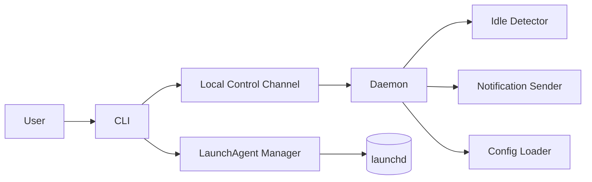
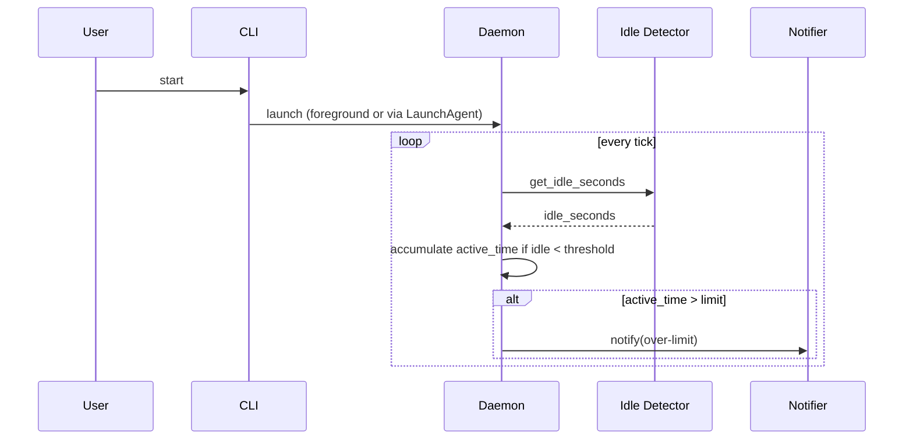
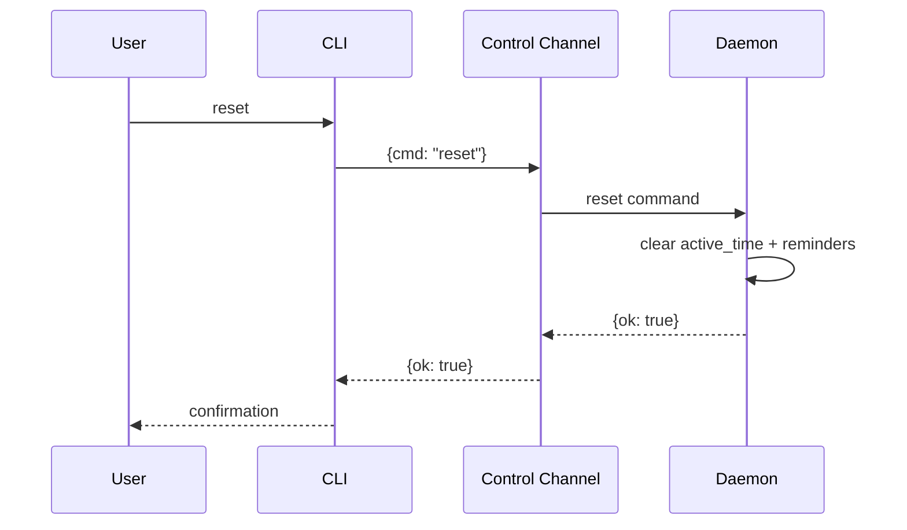

<!-- cpt:#:design -->
# Technical Design: Overwork Alert

<!-- cpt:##:architecture-overview -->
## 1. Architecture Overview

<!-- cpt:###:architectural-vision -->
### Architectural Vision

<!-- cpt:architectural-vision-body -->
Overwork Alert is a single-user, local-only macOS tool implemented as a background daemon with a companion CLI. The daemon continuously estimates “active work time” using an idle-aware clock and emits macOS notifications when a configurable limit is exceeded.

The system boundary is the user’s macOS session: the tool does not depend on remote services and does not persist accumulated work time across restarts. Architecture choices prioritize low complexity, low overhead, and predictable behavior (no automatic midnight reset; only explicit manual reset).
<!-- cpt:architectural-vision-body -->
<!-- cpt:###:architectural-vision -->

<!-- cpt:###:architecture-drivers -->
### Architecture drivers

<!-- cpt:####:prd-requirements -->
#### Product requirements

<!-- cpt:fr-title repeat="many" -->
##### Track active work time (idle-aware)

<!-- cpt:id-ref:fr has="priority,task" -->
- [x] `p1` - `cpt-overwork-alert-fr-track-active-time`
<!-- cpt:id-ref:fr -->

**Solution**: A daemon runs a periodic loop. Each tick reads current idle time from macOS (idle detector) and increments `active_time` only when idle is below the configured threshold and tracking is not paused.
<!-- cpt:fr-title repeat="many" -->

<!-- cpt:fr-title repeat="many" -->
##### Configure limit and idle threshold

<!-- cpt:id-ref:fr has="priority,task" -->
- [x] `p1` - `cpt-overwork-alert-fr-configurable-limit`
<!-- cpt:id-ref:fr -->

**Solution**: Configuration is read from a local config file with safe defaults. The daemon loads configuration on startup and can be restarted (or later extended to support reload) to apply changes.
<!-- cpt:fr-title repeat="many" -->

<!-- cpt:fr-title repeat="many" -->
##### Notify when limit is exceeded and repeat reminders

<!-- cpt:id-ref:fr has="priority,task" -->
- [x] `p1` - `cpt-overwork-alert-fr-notify-on-limit`
<!-- cpt:id-ref:fr -->

**Solution**: The daemon transitions into an “over limit” state when `active_time > limit`. A notifier component sends a macOS notification immediately, then repeats at the configured interval while the user remains active and the session is still over limit.
<!-- cpt:fr-title repeat="many" -->

<!-- cpt:fr-title repeat="many" -->
##### Manual reset (no automatic reset)

<!-- cpt:id-ref:fr has="priority,task" -->
- [x] `p2` - `cpt-overwork-alert-fr-manual-reset`
<!-- cpt:id-ref:fr -->

**Solution**: The daemon exposes a control channel. The CLI sends a `reset` command, which causes the daemon to zero the in-memory accumulated `active_time` and clear over-limit reminder state.
<!-- cpt:fr-title repeat="many" -->

<!-- cpt:fr-title repeat="many" -->
##### Run continuously in background and support autostart

<!-- cpt:id-ref:fr has="priority,task" -->
- [x] `p2` - `cpt-overwork-alert-fr-autostart`
<!-- cpt:id-ref:fr -->

**Solution**: Provide LaunchAgent installation/uninstallation that starts the daemon at login. The daemon is designed as a long-running process with safe defaults and defensive error handling.
<!-- cpt:fr-title repeat="many" -->

<!-- cpt:fr-title repeat="many" -->
##### Provide CLI controls (status/pause/resume/reset)

<!-- cpt:id-ref:fr has="priority,task" -->
- [x] `p2` - `cpt-overwork-alert-fr-cli-controls`
<!-- cpt:id-ref:fr -->

**Solution**: A CLI provides user-facing commands and communicates with the daemon via a local-only control interface to query status and issue commands.
<!-- cpt:fr-title repeat="many" -->

<!-- cpt:nfr-title repeat="many" -->
##### Privacy & Data Handling

<!-- cpt:id-ref:nfr has="priority,task" -->
- [x] `p1` - `cpt-overwork-alert-nfr-privacy-local-only`
<!-- cpt:id-ref:nfr -->

**Solution**: No network I/O is performed. Only minimal local configuration and runtime control artifacts (e.g., a local socket path) are used.
<!-- cpt:nfr-title repeat="many" -->

<!-- cpt:nfr-title repeat="many" -->
##### Reliability

<!-- cpt:id-ref:nfr has="priority,task" -->
- [x] `p2` - `cpt-overwork-alert-nfr-reliability`
<!-- cpt:id-ref:nfr -->

**Solution**: Notification failures are treated as non-fatal; tracking continues and status remains queryable via CLI. The daemon loop isolates OS integration errors so a single failed tick cannot crash the process.
<!-- cpt:nfr-title repeat="many" -->

<!-- cpt:nfr-title repeat="many" -->
##### Performance & Resource Usage

<!-- cpt:id-ref:nfr has="priority,task" -->
- [x] `p2` - `cpt-overwork-alert-nfr-low-overhead`
<!-- cpt:id-ref:nfr -->

**Solution**: Use low-frequency polling (seconds-level) for idle detection and accumulation. Avoid heavyweight dependencies and avoid high-frequency sampling.
<!-- cpt:nfr-title repeat="many" -->

<!-- cpt:####:prd-requirements -->

<!-- cpt:####:adr-records -->
#### Architecture Decisions Records

<!-- cpt:adr-title repeat="many" -->
##### Use CLI daemon + LaunchAgent (no menubar UI)

<!-- cpt:id-ref:adr has="priority,task" -->
- [x] `p1` - `cpt-overwork-alert-adr-cli-daemon-launchagent-no-menubar`
<!-- cpt:id-ref:adr -->

The implementation is split into a long-running daemon and a short-lived CLI. This keeps v1 small and repository-friendly, enables autostart via LaunchAgent, and avoids UI lifecycle complexity.
<!-- cpt:adr-title repeat="many" -->

<!-- cpt:####:adr-records -->
<!-- cpt:###:architecture-drivers -->

<!-- cpt:###:architecture-layers -->
### Architecture Layers

<!-- cpt:table:architecture-layers -->
| Layer | Responsibility | Technology |
|-------|---------------|------------|
| CLI / Control | User commands (status/pause/resume/reset), install/uninstall autostart | Python CLI (argparse), local IPC |
| Tracking Core | Idle-aware accumulation, over-limit state, reminder scheduling | Python daemon loop |
| OS Integration | Idle time signal, notification delivery, login autostart | `ioreg` idle time query, `osascript` notification, launchd LaunchAgent |
<!-- cpt:table:architecture-layers -->
<!-- cpt:###:architecture-layers -->
<!-- cpt:##:architecture-overview -->

<!-- cpt:##:principles-and-constraints -->
## 2. Principles & Constraints

<!-- cpt:###:principles -->
### 2.1: Design Principles

<!-- cpt:####:principle-title repeat="many" -->
#### Local-only and minimal state

<!-- cpt:id:principle has="priority,task" covered_by="DECOMPOSITION,SPEC" -->
- [x] `p1` - **ID**: `cpt-overwork-alert-principle-local-only-minimal-state`

<!-- cpt:paragraph:principle-body -->
The tool must not require network services and should store only what is necessary to operate. Accumulated active time is kept in-memory only and resets on daemon restart.
<!-- cpt:paragraph:principle-body -->
<!-- cpt:id:principle -->
<!-- cpt:####:principle-title repeat="many" -->

<!-- cpt:####:principle-title repeat="many" -->
#### Predictable, explicit user control

<!-- cpt:id:principle has="priority,task" covered_by="DECOMPOSITION,SPEC" -->
- [x] `p1` - **ID**: `cpt-overwork-alert-principle-explicit-control`

<!-- cpt:paragraph:principle-body -->
The system should not make time-based policy decisions like automatic midnight resets. Resetting and pausing are explicit user actions via the CLI.
<!-- cpt:paragraph:principle-body -->
<!-- cpt:id:principle -->
<!-- cpt:####:principle-title repeat="many" -->

<!-- cpt:####:principle-title repeat="many" -->
#### Low overhead background behavior

<!-- cpt:id:principle has="priority,task" covered_by="DECOMPOSITION,SPEC" -->
- [x] `p2` - **ID**: `cpt-overwork-alert-principle-low-overhead`

<!-- cpt:paragraph:principle-body -->
The daemon must be suitable for always-on use: avoid tight loops, prefer coarse polling intervals, and keep OS interactions lightweight.
<!-- cpt:paragraph:principle-body -->
<!-- cpt:id:principle -->
<!-- cpt:####:principle-title repeat="many" -->

<!-- cpt:###:principles -->

<!-- cpt:###:constraints -->
### 2.2: Constraints

<!-- cpt:####:constraint-title repeat="many" -->
#### macOS-only, no custom UI surface

<!-- cpt:id:constraint has="priority,task" covered_by="DECOMPOSITION,SPEC" -->
- [x] `p1` - **ID**: `cpt-overwork-alert-constraint-macos-cli-only`

<!-- cpt:paragraph:constraint-body -->
The v1 tool targets macOS only and is delivered as CLI + daemon; there is no menubar application or custom GUI.
<!-- cpt:paragraph:constraint-body -->
<!-- cpt:id:constraint -->
<!-- cpt:####:constraint-title repeat="many" -->

<!-- cpt:####:constraint-title repeat="many" -->
#### No automatic reset and no persistence of accumulated time

<!-- cpt:id:constraint has="priority,task" covered_by="DECOMPOSITION,SPEC" -->
- [x] `p1` - **ID**: `cpt-overwork-alert-constraint-no-auto-reset-no-persist`

<!-- cpt:paragraph:constraint-body -->
Accumulated active work time is session-scoped: it resets when the daemon restarts and only resets during runtime when the user explicitly invokes manual reset.
<!-- cpt:paragraph:constraint-body -->
<!-- cpt:id:constraint -->
<!-- cpt:####:constraint-title repeat="many" -->

<!-- cpt:###:constraints -->
<!-- cpt:##:principles-and-constraints -->

<!-- cpt:##:technical-architecture -->
## 3. Technical Architecture

<!-- cpt:###:domain-model -->
### 3.1: Domain Model

<!-- cpt:paragraph:domain-model -->
Core types and invariants:

- `Config`: `limit_seconds`, `idle_threshold_seconds`, `repeat_interval_seconds`, and integration settings (e.g., socket path).
- `TrackerState`: `status` (running/paused), `active_time_seconds`, `over_limit_since`, `last_reminder_at`, `last_tick_at`.
- `IdleSample`: current `idle_seconds` observed from macOS.
- `ControlCommand`: one of `status`, `pause`, `resume`, `reset`, `stop`.

Invariants:

- `active_time_seconds` increases only while `status=running` and `idle_seconds < idle_threshold_seconds`.
- When `active_time_seconds > limit_seconds`, the system is considered “over limit” until a reset occurs.
- `reset` sets `active_time_seconds` to zero and clears over-limit reminder scheduling state.
<!-- cpt:paragraph:domain-model -->
<!-- cpt:###:domain-model -->

<!-- cpt:###:component-model -->
### 3.2: Component Model

<!-- cpt:code:component-model -->

<!-- cpt:code:component-model -->

<!-- cpt:####:component-title repeat="many" -->
#### CLI

<!-- cpt:id:component has="priority,task" covered_by="DECOMPOSITION,SPEC" -->
- [x] `p1` - **ID**: `cpt-overwork-alert-component-cli`

<!-- cpt:list:component-payload -->
- **Responsibilities**: Parse user commands; display status; send control commands to daemon; manage LaunchAgent installation.
- **Boundaries**: No tracking logic; no accumulation; no background loop.
- **Dependencies**: Control Channel; LaunchAgent Manager.
- **Key interfaces**: `overwork-alert status|pause|resume|reset|start|stop|install-autostart|uninstall-autostart`.
<!-- cpt:list:component-payload -->
<!-- cpt:id:component -->
<!-- cpt:####:component-title repeat="many" -->

<!-- cpt:####:component-title repeat="many" -->
#### Daemon / Tracker Loop

<!-- cpt:id:component has="priority,task" covered_by="DECOMPOSITION,SPEC" -->
- [x] `p1` - **ID**: `cpt-overwork-alert-component-daemon`

<!-- cpt:list:component-payload -->
- **Responsibilities**: Maintain in-memory `TrackerState`; run periodic tick loop; decide when to notify; respond to control commands.
- **Boundaries**: Does not persist accumulated time; does not render UI; avoids network I/O.
- **Dependencies**: Idle Detector; Notification Sender; Config Loader; Control Channel.
- **Key interfaces**: `tick(state, config, idle_sample) -> state`; `handle_command(cmd) -> response`.
<!-- cpt:list:component-payload -->
<!-- cpt:id:component -->
<!-- cpt:####:component-title repeat="many" -->

<!-- cpt:####:component-title repeat="many" -->
#### Local Control Channel

<!-- cpt:id:component has="priority,task" covered_by="DECOMPOSITION,SPEC" -->
- [x] `p2` - **ID**: `cpt-overwork-alert-component-control-channel`

<!-- cpt:list:component-payload -->
- **Responsibilities**: Provide local-only communication between CLI and daemon.
- **Boundaries**: Not remotely accessible; does not require privileged ports.
- **Dependencies**: OS sockets.
- **Key interfaces**: Request/response messages for `status`, `pause`, `resume`, `reset`, and `stop`.
<!-- cpt:list:component-payload -->
<!-- cpt:id:component -->
<!-- cpt:####:component-title repeat="many" -->

<!-- cpt:####:component-title repeat="many" -->
#### Idle Detector

<!-- cpt:id:component has="priority,task" covered_by="DECOMPOSITION,SPEC" -->
- [x] `p2` - **ID**: `cpt-overwork-alert-component-idle-detector`

<!-- cpt:list:component-payload -->
- **Responsibilities**: Query macOS for current idle duration and return an `IdleSample`.
- **Boundaries**: Best-effort; failures return an error that the daemon treats as “unknown idle” and skips accumulation for that tick.
- **Dependencies**: `ioreg` (IOHIDSystem) via subprocess.
- **Key interfaces**: `get_idle_seconds() -> int`.
<!-- cpt:list:component-payload -->
<!-- cpt:id:component -->
<!-- cpt:####:component-title repeat="many" -->

<!-- cpt:####:component-title repeat="many" -->
#### Notification Sender

<!-- cpt:id:component has="priority,task" covered_by="DECOMPOSITION,SPEC" -->
- [x] `p2` - **ID**: `cpt-overwork-alert-component-notifier`

<!-- cpt:list:component-payload -->
- **Responsibilities**: Deliver a macOS user notification for over-limit alerts.
- **Boundaries**: Best-effort; failures do not stop tracking.
- **Dependencies**: `osascript` (AppleScript) via subprocess.
- **Key interfaces**: `notify(title, message) -> None`.
<!-- cpt:list:component-payload -->
<!-- cpt:id:component -->
<!-- cpt:####:component-title repeat="many" -->

<!-- cpt:####:component-title repeat="many" -->
#### Config Loader

<!-- cpt:id:component has="priority,task" covered_by="DECOMPOSITION,SPEC" -->
- [x] `p2` - **ID**: `cpt-overwork-alert-component-config-loader`

<!-- cpt:list:component-payload -->
- **Responsibilities**: Load configuration from a local file and apply defaults.
- **Boundaries**: No remote configuration; invalid values result in safe fallback behavior.
- **Dependencies**: Local file system; Python stdlib config parsing.
- **Key interfaces**: `load_config() -> Config`.
<!-- cpt:list:component-payload -->
<!-- cpt:id:component -->
<!-- cpt:####:component-title repeat="many" -->

<!-- cpt:####:component-title repeat="many" -->
#### LaunchAgent Manager

<!-- cpt:id:component has="priority,task" covered_by="DECOMPOSITION,SPEC" -->
- [x] `p2` - **ID**: `cpt-overwork-alert-component-launchagent-manager`

<!-- cpt:list:component-payload -->
- **Responsibilities**: Install/uninstall a user LaunchAgent plist for autostart; start/stop the LaunchAgent.
- **Boundaries**: User-level LaunchAgent only (no system-wide daemon).
- **Dependencies**: `launchctl` and LaunchAgent plist format.
- **Key interfaces**: `install()`, `uninstall()`, `start()`, `stop()`.
<!-- cpt:list:component-payload -->
<!-- cpt:id:component -->
<!-- cpt:####:component-title repeat="many" -->

<!-- cpt:###:component-model -->

<!-- cpt:###:api-contracts -->
### 3.3: API Contracts

<!-- cpt:paragraph:api-contracts -->
External surface area is the CLI plus a local-only control contract between CLI and daemon.

CLI contract (high level):

- `overwork-alert start`: start daemon (foreground for dev, or as LaunchAgent).
- `overwork-alert status`: show `TrackerState` (active time, limit, paused/running, over-limit flag).
- `overwork-alert pause|resume`: toggle `TrackerState.status`.
- `overwork-alert reset`: clear session accumulation and reminder state.
- `overwork-alert stop`: stop daemon.
- `overwork-alert install-autostart|uninstall-autostart`: manage LaunchAgent.

Control channel contract (high level): request/response messages encoded as JSON. Example request:

`{"cmd":"status"}`

Example response:

`{"status":"running","active_time_seconds":5400,"limit_seconds":10800,"over_limit":false}`
<!-- cpt:paragraph:api-contracts -->
<!-- cpt:###:api-contracts -->

<!-- cpt:###:interactions -->
### 3.4: Interactions & Sequences

<!-- cpt:####:sequence-title repeat="many" -->
#### Run tracker and receive an overwork alert

<!-- cpt:id:seq has="priority,task" covered_by="DECOMPOSITION,SPEC" -->
- [x] `p1` - **ID**: `cpt-overwork-alert-seq-run-and-alert`

<!-- cpt:code:sequences -->

<!-- cpt:code:sequences -->

<!-- cpt:paragraph:sequence-body -->
The user starts the tracker. The daemon periodically samples idle time and increments active time only when the user is not idle beyond threshold. When the configured limit is exceeded, the daemon sends a macOS notification and schedules repeats at the configured interval while the user remains active and tracking is running.
<!-- cpt:paragraph:sequence-body -->
<!-- cpt:id:seq -->
<!-- cpt:####:sequence-title repeat="many" -->

<!-- cpt:####:sequence-title repeat="many" -->
#### Reset a session via CLI

<!-- cpt:id:seq has="priority,task" covered_by="DECOMPOSITION,SPEC" -->
- [x] `p2` - **ID**: `cpt-overwork-alert-seq-cli-reset`

<!-- cpt:code:sequences -->

<!-- cpt:code:sequences -->

<!-- cpt:paragraph:sequence-body -->
The user issues a reset command. The CLI sends a local control request to the daemon, which clears the in-memory accumulated active time and reminder scheduling state.
<!-- cpt:paragraph:sequence-body -->
<!-- cpt:id:seq -->
<!-- cpt:####:sequence-title repeat="many" -->

<!-- cpt:###:interactions -->

<!-- cpt:###:database -->
### 3.5 Database schemas & tables (optional)

No persistent database is used in v1. The following “tables” describe the conceptual runtime data model that is held in memory only.

<!-- cpt:####:db-table-title repeat="many" -->
#### Table tracker_state (conceptual; in-memory only)

<!-- cpt:id:dbtable has="priority,task" covered_by="DECOMPOSITION,SPEC" -->
- [x] `p2` - **ID**: `cpt-overwork-alert-dbtable-tracker-state`

**Schema**
<!-- cpt:table:db-table-schema -->
| Column | Type | Description |
|--------|------|-------------|
| status | string | `running` or `paused` |
| active_time_seconds | integer | Accumulated active time for the current daemon session |
| limit_seconds | integer | Effective configured limit used for comparisons |
| over_limit_since | string | ISO-8601 timestamp when the session first exceeded the limit, or empty |
| last_reminder_at | string | ISO-8601 timestamp when the last over-limit reminder was sent, or empty |
<!-- cpt:table:db-table-schema -->

**PK**: N/A (in-memory struct)

**Constraints**: `active_time_seconds >= 0`, `limit_seconds > 0`

**Additional info**: Resets on daemon restart; `reset` clears `active_time_seconds`, `over_limit_since`, and `last_reminder_at`.

**Example**
<!-- cpt:table:db-table-example -->
| status | active_time_seconds | limit_seconds | over_limit_since | last_reminder_at |
|--------|---------------------|--------------|------------------|-----------------|
| running | 5400 | 10800 |  |  |
<!-- cpt:table:db-table-example -->
<!-- cpt:id:dbtable -->
<!-- cpt:####:db-table-title repeat="many" -->

<!-- cpt:####:db-table-title repeat="many" -->
#### Table config (conceptual; file-backed)

<!-- cpt:id:dbtable has="priority,task" covered_by="DECOMPOSITION,SPEC" -->
- [x] `p2` - **ID**: `cpt-overwork-alert-dbtable-config`

**Schema**
<!-- cpt:table:db-table-schema -->
| Column | Type | Description |
|--------|------|-------------|
| limit_seconds | integer | Work-time limit threshold |
| idle_threshold_seconds | integer | Idle threshold after which accumulation pauses |
| repeat_interval_seconds | integer | Reminder repeat interval after first over-limit alert |
| control_socket_path | string | Filesystem path to local control socket |
<!-- cpt:table:db-table-schema -->

**PK**: N/A (single config document)

**Constraints**: All numeric values must be positive. Missing/invalid values fall back to safe defaults.

**Additional info**: Stored as a local configuration file; changes apply after daemon restart (v1).

**Example**
<!-- cpt:table:db-table-example -->
| limit_seconds | idle_threshold_seconds | repeat_interval_seconds | control_socket_path |
|--------------|------------------------|------------------------|---------------------|
| 10800 | 300 | 1800 | /tmp/overwork-alert.sock |
<!-- cpt:table:db-table-example -->
<!-- cpt:id:dbtable -->
<!-- cpt:####:db-table-title repeat="many" -->

<!-- cpt:###:database -->

<!-- cpt:###:topology -->
### 3.6: Topology (optional)

<!-- cpt:id:topology has="task" -->
**ID**: `cpt-overwork-alert-topology-single-daemon`

<!-- cpt:free:topology-body -->
A single user-level daemon process runs per logged-in user session. The CLI runs as short-lived processes that communicate with the daemon over a local-only control channel. Autostart is provided by a user LaunchAgent.
<!-- cpt:free:topology-body -->
<!-- cpt:id:topology -->
<!-- cpt:###:topology -->

<!-- cpt:###:tech-stack -->
### 3.7: Tech stack (optional)

<!-- cpt:paragraph:status -->
**Status**: Accepted
<!-- cpt:paragraph:status -->

<!-- cpt:paragraph:tech-body -->
Python 3.13+ using the standard library for the daemon loop, CLI, IPC, and configuration parsing. macOS integration is done via `launchd` (LaunchAgent plist + `launchctl`), idle time querying via `ioreg`, and Notification Center delivery via `osascript`.
<!-- cpt:paragraph:tech-body -->
<!-- cpt:###:tech-stack -->
<!-- cpt:##:technical-architecture -->

<!-- cpt:##:design-context -->
## 4. Additional Context

<!-- cpt:free:design-context-body -->
- PRD: `examples/overwork_alert/architecture/PRD.md`
- ADR-0001: `examples/overwork_alert/architecture/ADR/general/0001-cpt-overwork-alert-adr-cli-daemon-launchagent-no-menubar-v1.md`
<!-- cpt:free:design-context-body -->

<!-- cpt:paragraph:date -->
**Date**: 2026-02-06
<!-- cpt:paragraph:date -->
<!-- cpt:##:design-context -->

<!-- cpt:#:design -->
