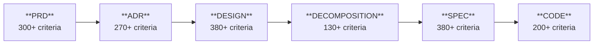

# Spider SDLC Quick Start

**Learn Spider SDLC in 10 minutes with real prompts and examples**

Spider SDLC works through the `spider` skill — enable it with `spider on` and use natural language prompts prefixed with `spider`. The skill handles artifact discovery, template loading, validation, and traceability automatically.

---

## What You'll Learn

1. **Exact prompts to type** — copy-paste into your AI chat
2. **Complete pipeline** — from requirements to validated code
3. **Reverse engineering** — create artifacts from existing code
4. **Working with existing docs** — import what you already have

---

## The Pipeline

Spider SDLC = **Design First, Code Second**

| Artifact | Purpose |
|----------|---------|
| **PRD** | Product requirements — actors, capabilities, requirements, use cases, constraints |
| **ADR** | Architecture Decision Record — context, options, decision, consequences |
| **DESIGN** | Technical architecture — components, interfaces, data models, sequences |
| **DECOMPOSITION** | Spec breakdown — ordered implementation units with dependencies |
| **SPEC** | Spec acceptance criteria, flows, algorithms, edge cases, definitions of done |
| **CODE** | Implementation — tagged with `@spider-*` markers for traceability |

**Key principle**: If code contradicts design, fix design first, then regenerate code.

Learn what each artifact means: [TAXONOMY.md](TAXONOMY.md)

---

## Getting Started

| Prompt | What happens |
|--------|--------------|
| `spider on` | Enables Spider mode, discovers adapter, loads project context |
| `spider init` | Creates `.spider-adapter/` with `artifacts.json` and domain specs |
| `spider show pipeline` | Displays current artifact hierarchy and validation status |

**Customizing artifact locations:**

| Prompt | What happens |
|--------|--------------|
| `spider set artifacts_dir to docs/design/` | Changes default base directory for new artifacts |
| `spider register PRD at specs/product-requirements.md` | Registers existing file as PRD artifact |
| `spider move PRD to docs/requirements/PRD.md` | Moves artifact and updates registry |
| `spider show artifact locations` | Displays current paths from `artifacts.json` |

---

## Example Prompts — Greenfield Project

**PRD — Product Requirements**

| Prompt | What the agent does |
|--------|---------------------|
| `spider make PRD` | Generates PRD interactively, asking for context |
| `spider make PRD for task management API` | Generates PRD with actors, requirements, flows |
| `spider draft PRD from README` | Creates PRD draft from existing README |
| `spider extend PRD with notifications` | Adds new capability to existing PRD |
| `spider validate PRD` | Full validation (300+ criteria) |
| `spider validate PRD semantic` | Semantic validation only (completeness, clarity) |
| `spider validate PRD structural` | Structural validation only (format, IDs, template) |
| `spider validate PRD refs` | Check cross-references to other artifacts |

**ADR — Architecture Decision Records**

| Prompt | What the agent does |
|--------|---------------------|
| `spider make ADR for PostgreSQL` | Creates ADR for technology choice |
| `spider make ADR for REST vs GraphQL` | Creates ADR comparing approaches |
| `spider draft ADR from discussion` | Extracts decision from conversation |
| `spider list ADRs` | Shows all ADRs with status |
| `spider validate ADR` | Validates all ADRs (270+ criteria each) |
| `spider validate ADR 0001` | Validates specific ADR by number |
| `spider validate ADR semantic` | Semantic validation (rationale quality) |
| `spider validate ADR structural` | Structural validation (format, sections) |

**DESIGN — Technical Architecture**

| Prompt | What the agent does |
|--------|---------------------|
| `spider make DESIGN` | Creates DESIGN from PRD interactively |
| `spider make DESIGN from PRD` | Transforms PRD into architecture |
| `spider extend DESIGN with caching layer` | Adds new component to existing DESIGN |
| `spider update DESIGN components` | Updates component section |
| `spider validate DESIGN` | Full validation (380+ criteria) |
| `spider validate DESIGN semantic` | Semantic validation (consistency, completeness) |
| `spider validate DESIGN structural` | Structural validation (format, IDs) |
| `spider validate DESIGN refs` | Check references to PRD/ADR |

**DECOMPOSITION — Spec Breakdown**

| Prompt | What the agent does |
|--------|---------------------|
| `spider decompose` | Creates DECOMPOSITION interactively |
| `spider decompose into specs` | Creates ordered spec list with dependencies |
| `spider decompose by capability` | Groups specs by business capability |
| `spider decompose by layer` | Groups specs by technical layer |
| `spider add spec to decomposition` | Adds new spec entry |
| `spider validate DECOMPOSITION` | Full validation (130+ criteria) |
| `spider validate DECOMPOSITION semantic` | Semantic validation (coverage, dependencies) |
| `spider validate DECOMPOSITION structural` | Structural validation (format, IDs) |

**SPEC — Spec Specification**

| Prompt | What the agent does |
|--------|---------------------|
| `spider make SPEC for auth` | Creates spec spec for auth |
| `spider make SPEC spec for task-crud` | Creates detailed spec design |
| `spider draft SPEC from code` | Reverse-engineers spec from implementation |
| `spider extend SPEC auth with MFA` | Adds scenario to existing spec |
| `spider validate SPEC auth` | Full validation (380+ criteria) |
| `spider validate SPEC auth semantic` | Semantic validation (flows, edge cases) |
| `spider validate SPEC auth structural` | Structural validation (SDSL format, IDs) |
| `spider validate SPEC auth refs` | Check references to DESIGN/DECOMPOSITION |

**CODE — Implementation**

| Prompt | What the agent does |
|--------|---------------------|
| `spider implement {slug}` | Generates code from SPEC spec |
| `spider implement {slug} step by step` | Implements with user confirmation |
| `spider implement {slug} tests first` | Generates tests first, then code |
| `spider implement {slug} flow {flow-id}` | Implements specific flow only |
| `spider implement {slug} api` | Implements API layer only |
| `spider implement {slug} tests` | Generates tests only |
| `spider continue implementing {slug}` | Continues partial implementation |
| `spider implement {slug} remaining` | Implements only unimplemented parts |
| `spider sync code with SPEC {slug}` | Updates code to match SPEC |
| `spider add markers to {path}` | Adds markers to existing code |
| `spider add markers for {slug}` | Adds markers matching SPEC |

**CODE — Validation**

| Prompt | What the agent does |
|--------|---------------------|
| `spider validate code` | Validates all code markers |
| `spider validate code for {slug}` | Validates specific spec |
| `spider validate code coverage` | Reports implementation coverage % |
| `spider validate code coverage for {slug}` | Coverage for specific spec |
| `spider validate code orphans` | Finds orphaned markers |
| `spider validate code refs` | Validates marker references |
| `spider validate code markers` | Checks marker format |
| `spider list code markers` | Lists all markers |
| `spider list code markers for {slug}` | Lists markers for spec |
| `spider show uncovered flows` | Lists flows without code |
| `spider compare code to SPEC {slug}` | Shows drift from spec |
| `spider find missing implementations` | Lists unimplemented elements |

**Pipeline & Cross-Artifact**

| Prompt | What the agent does |
|--------|---------------------|
| `spider validate all` | Validates entire hierarchy |
| `spider validate refs` | Checks all cross-references |
| `spider show pipeline` | Displays artifact status |
| `spider coverage report` | Summary of implementation coverage |

---

## Example Prompts — Brownfield Project

**Reverse-engineer from code**

| Prompt | What the agent does |
|--------|---------------------|
| `spider reverse PRD from codebase` | Extracts requirements from existing implementation |
| `spider reverse DESIGN from src/` | Documents current architecture from code |
| `spider reverse SPEC from src/auth/` | Creates SPEC spec from auth module |
| `spider reverse SPEC auth from code` | Same, using spec slug |
| `spider analyze src/api/` | Systematic code analysis with checklist |

**Import from existing docs**

| Prompt | What the agent does |
|--------|---------------------|
| `spider make PRD from docs/requirements.txt` | Extracts requirements into PRD format |
| `spider make PRD from README` | Creates PRD from project README |
| `spider make PRD from this conversation` | Creates PRD from stakeholder discussion |
| `spider import OpenAPI as DESIGN` | Converts API spec into DESIGN |
| `spider import db-schema.sql as DESIGN data model` | Extracts data model from SQL |
| `spider convert user-stories.md to PRD` | Transforms user stories to PRD |

**Sync and compare**

| Prompt | What the agent does |
|--------|---------------------|
| `spider compare DESIGN to code` | Shows drift between design and implementation |
| `spider sync DESIGN from code` | Updates DESIGN to match current code |
| `spider diff SPEC auth` | Shows changes since last validation |

---

## Example Prompts — Evolution & Maintenance

**Extend artifacts**

| Prompt | What the agent does |
|--------|---------------------|
| `spider extend PRD with payments` | Adds capability to PRD |
| `spider extend DESIGN with caching` | Adds component to DESIGN |
| `spider extend SPEC auth with MFA` | Adds scenario to spec |
| `spider add spec billing to decomposition` | Adds spec entry |

**Update and propagate**

| Prompt | What the agent does |
|--------|---------------------|
| `spider update PRD requirements` | Updates requirements section |
| `spider propagate PRD changes to DESIGN` | Updates DESIGN from PRD changes |
| `spider sync DESIGN from code` | Updates DESIGN to match implementation |

**Impact analysis**

| Prompt | What the agent does |
|--------|---------------------|
| `spider show impact of removing FR-AUTH-002` | Traces downstream references |
| `spider show impact of changing component auth` | Shows affected artifacts |
| `spider deprecate spec user-import` | Marks deprecated across artifacts |

**Refactoring**

| Prompt | What the agent does |
|--------|---------------------|
| `spider refactor component auth-service` | Updates DESIGN and SPECs |
| `spider rename spec billing to payments` | Renames across all artifacts |
| `spider split spec payments` | Creates sub-specs |
| `spider merge specs billing and invoicing` | Combines specs |

---

## Example Prompts — Review & Quality

**Validation modes**

| Prompt | What the agent does |
|--------|---------------------|
| `spider validate {ARTIFACT}` | Full validation (structural + semantic) |
| `spider validate {ARTIFACT} semantic` | Semantic only (content quality, completeness) |
| `spider validate {ARTIFACT} structural` | Structural only (format, IDs, template compliance) |
| `spider validate {ARTIFACT} refs` | Cross-reference validation only |
| `spider validate {ARTIFACT} quick` | Fast check (critical issues only) |
| `spider validate all` | Full validation of entire pipeline |
| `spider validate all semantic` | Semantic validation across all artifacts |

**Traceability queries**

| Prompt | What the agent does |
|--------|---------------------|
| `spider trace FR-AUTH-001` | Shows path: PRD → DESIGN → SPEC → CODE |
| `spider trace spec auth` | Shows all references to auth spec |
| `spider find orphans` | Lists IDs with no upstream/downstream refs |
| `spider find orphan code` | Code markers referencing non-existent IDs |
| `spider find orphan requirements` | Requirements not covered by DESIGN |
| `spider list unimplemented` | Specs without code coverage |
| `spider coverage report` | Implementation coverage by artifact |
| `spider show refs for DESIGN` | All references in DESIGN artifact |

**Review prompts**

| Prompt | What the agent does |
|--------|---------------------|
| `spider review PRD` | Deep review with 300+ criteria |
| `spider review DESIGN for consistency` | Checks for internal contradictions |
| `spider review SPEC auth for completeness` | Validates edge cases and error handling |
| `spider review PR #42 against SPEC` | Checks PR implements spec items |
| `spider review code for auth` | Reviews implementation quality |

---

## Live Example

[Taskman (Spider example project)](https://github.com/cyberfabric/spider-examples-taskman) — a complete task management project with the full Spider artifact set and implementation.

---

## Guides by Scenario

| Scenario | Guide | Key Point |
|----------|-------|-----------|
| **Greenfield** | [GREENFIELD.md](GREENFIELD.md) | Start from PRD, work down to code |
| **Brownfield** | [BROWNFIELD.md](BROWNFIELD.md) | Start anywhere — code-only, bottom-up, or full |
| **Modular monolith** | [MONOLITH.md](MONOLITH.md) | Project-level + module-level artifacts |

**Brownfield flexibility**: No required order. Start with code-only (checklist benefits), add SPEC specs for complex specs, add DESIGN later. Or go full top-down. Your choice.

## Reference

- Artifact taxonomy: [TAXONOMY.md](TAXONOMY.md)
- Full prompt reference: [README.md](../../../README.md#example-prompts)
